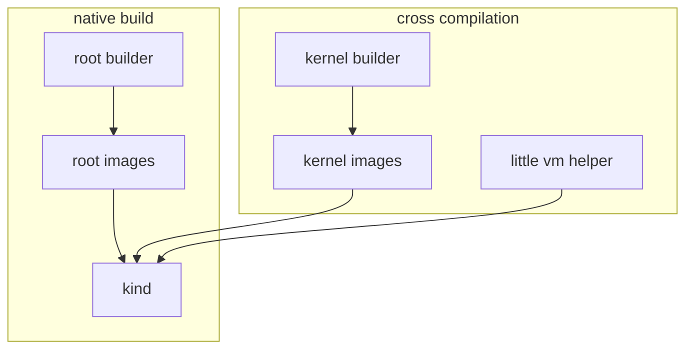

This repository contains [little-vm-helper](https://github.com/cilium/little-vm-helper)
configuration files and dockerfiles for building kernel and rootfs images. The latter are stored in
OCI images (https://quay.io/organization/lvh-images) so that they can be used in
testing/development.

## Use

The easiest way to use this repository is via the Makefile, which performs the builds in docker
containers that include all the necessary dependnecies. `make` without arguments will print a list
of targets. Alternatively, [lvh](https://github.com/cilium/little-vm-helper/) can be used directly,
which is  faster but requres the necessary tools (e.g., guestfs-tools) to be installed in the host.

### Build and start a VM using Makefile

The Makefile targets will produce docker images that contain the generated root image(s). The
commands below will generate the root images, extract the base image, and use it to boot a VM.

```
$ make images
...
 => => writing image sha257:96a86e6ebb38238569c007491c3e86a056340ceb9e4a3e66959bfa6a6ca8f8a0
 => => naming to quay.io/lvh-images/root-images
$ c=$(docker create sha256:96a86e6ebb38238569c007491c3e86a056340ceb9e4a3e66959bfa6a6ca8f8a0)
$ docker cp $c:/data/images/base.qcow2.zst /tmp
$ zstd --decompress /tmp/base.qcow2.zst
$ lvh run --host-mount $(pwd) --image /tmp/base.qcow2
```

### Build and start a VM with lvh

The command below will directly buid the base image, and use it to boot a VM.

```
$ lvh images --dir _data build --image base.qcow2
$ lvh  run --host-mount $(pwd) --image _data/images/base.qcow2
```

## Configuration files

### LVH configuration (under \_data)

- [images.json](_data/images.json) is the configuration for building root images. There are two root images:
  base and kind. The former is intended for simple tests (e.g., [tetragon unit
  tests](https://github.com/cilium/tetragon/tree/main/tests/vmtests)) and the latter
  for kind-based tests.

- [kernels.json](_data/kernels.json) is the configuration for the various kernels.

### Dockerfiles

- [kernel-builder](./dockerfiles/kernel-builder) builds a container for building kernel images
  images
- [kernel-images](./dockerfiles/kernel-images) builds a container with the kernel images
- [root-builder](./dockerfiles/root-builder) builds a container for building root images
- [root-images](./dockerfiles/root-images) builds a container with all the root images
- [kind-images](./dockerfiles/kind-images) builds kernel-specific version of the kind image
- [complexity-test-images](./dockerfiles/complexity-test-images) builds kernel-specific versions of
  the complexity-test-image

### Root images package repository

Some packages on which the guest OS depends may not be fully compatible with the kernel version of that OS.
To overcome that, the root images can be built by pulling packages from different debian package repositories.
To select which package repository to pull packages from, the Dockerfiles can be passed a `PKG_REPO` variable,
which should correspond to one of the upstream debian respositories (ex: `sid`, `bookworm`, `trixie`, etc).

This value is then passed to `lvh images build` to instruct the bootstrap command appropriately.

### Rhel8

Rhel8 images are a bit specials and have their own
[kernel-images-rhel8](./dockerfiles/kernel-images-rhel8).
The exact version of the rhel8 kernel we clone can be found in the
[buildx.yaml](.github/workflows/buildx.yaml) GitHub workflow file and has a
special treatment in the ["kernel versions" step](https://github.com/cilium/little-vm-helper-images/blob/d59049f4be64565a491c73820ff02aa63f209c81/.github/workflows/buildx.yaml#L85-L96).
Please note that previous link is a permalink and the versions might have
changed.

At the time of writing, this was the versions we built. You can notice that we
also build those only for amd64 unlike the rest of the kernels.

```javascript
case 'rhel8.9':
    options.dockerfile = "dockerfiles/kernel-images-rhel8"
    options.platforms = 'linux/amd64'
    options.rhel_ver = '8.9'
    options.rhel_kver = '4.18.0-513.24.1.el8_9'
    options.pkg_repo = 'bookworm'
    break
default:
    options.dockerfile = "dockerfiles/kernel-images"
    options.platforms = 'linux/amd64,linux/arm64'
    options.pkg_repo = 'sid'
```

## GH actions

This repository includes GH actions for automatically building and pushing images. Whenever a PR is
opened, the buildx GH action will:
 - generate a unique tag based on the day
 - build the images
 - push the images with the unqique tag

### How can I ensure that new rootfs images are build?

The action will not build the root images unless configuration files have changed.
There is a `check-files` input parameter that determines what files are checked to
determine if an image will be build. If you want to ensure that an image is build, you
can add a comment to the dockerfile of the image.

### Can I only create builds for specific kernels?

Yes, via `gha-builds/kernel/XXX` labes in PRs.

Kernel images and rootfs images that depend on kernels are treated differently. By default, they will always be build
because the kernels might have been updated. This can be controlled with adding `gha-buidlds/kernel/XXX` labels to the PRs.
These labels (if added) determine what kernels versions are build. For example, adding the `gha-builds/kernel/bpf-next` label,
results in images  for the `bpf-next` version be build.

### Can I completely disable builds for a PR?

Yes, you can use the `gha-builds/justdont` label.

### How does the arm64 builds works?

The build of LVH and the kernel can be done using cross-compilation which
simplifies a lot the build of multi-arch images. Unfortunately, the part that
build the images relies libguestfs that cannot work as of now for different
target architectures than the host architecture. However switching to use only
mmdebstrap, which can easily cross-build images, and get rid of libguestfs
would solve this duality.




As of now, each steps to build an image (the left on the diagram above), for
example kind, are built on native runners and produce arch specific images
(with the `-<arch>` suffix in the tag), a multi-arch tag is then produced,
merging the architecture specific images, for the final result ease of use.
